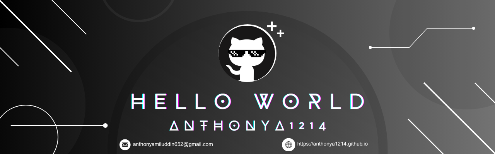
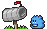

<!-- Banner -->

<!-- Header -->
<h3 align="center">
   ɪ'ᴍ ᴀɴᴛʜᴏɴʏ! 
</h3>

<i>BS Computer Science Student | University of Caloocan City</i>

---

###  ​🇦​​🇧​​🇴​​🇺​​🇹​ ​🇲​​🇪

- 🎓 Bachelor of Science in Computer Science  
- 💻 Passionate about coding, learning new tech, and building cool projects  
- 🌱 Currently exploring: **Web Development**  
- 📚 Always eager to grow and collaborate on fun & meaningful projects  

---

###  ​🇹​​🇴​​🇴​​🇱​​🇸​ ​🇮​ ​🇺​​🇸​​🇪​

  

---

###  ​🇵​​🇷​​🇴​​🇯​​🇪​​🇨​​🇹​​🇸​

####  What I’ve Built

- 📚 **Library Management System**  
   *Built with:* WinForms + SQL Server

- 📖 **Web Novel Reader Site** *(WIP)*  
   *Built with:* Flask + Bootstrap

>  Explore more in my pinned repositories below 

---

###  ​🇬​​🇮​​🇹​​🇭​​🇺​​🇧​ ​🇸​​🇹​​🇦​​🇹​​🇸​

  
   
  

---

###  ​🇬​​🇮​​🇹​​🇭​​🇺​​🇧​ 🇹​​🇷​​🇴​​🇵​​🇭​​🇮​​🇪​​🇸​

  

---

###  ​🇨​​🇴​​🇳​​🇹​​🇷​​🇮​​🇧​​🇺​​🇹​​🇮​​🇴​​🇳​ ​🇬​​🇷​​🇦​​🇵​​🇭​

  

---

###  ​🇹​​🇭​​🇴​​🇺​​🇬​​🇭​​🇹​ ​🇴​​🇫​ ​🇹​​🇭​​🇪​ ​🇩​​🇦​​🇾​

  

---

###  ​🇱​​🇪​​🇹​❜​🇸​ ​🇨​​🇴​​🇳​​🇳​​🇪​​🇨​​🇹​

  
  
  
  
  

---

   <i>Thanks for stopping by! Feel free to check out my work and reach out!</i> 

  

